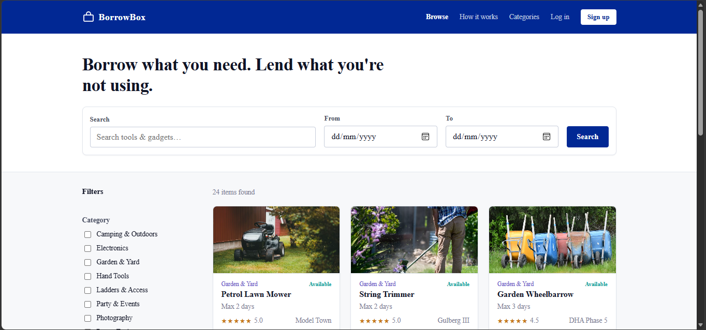
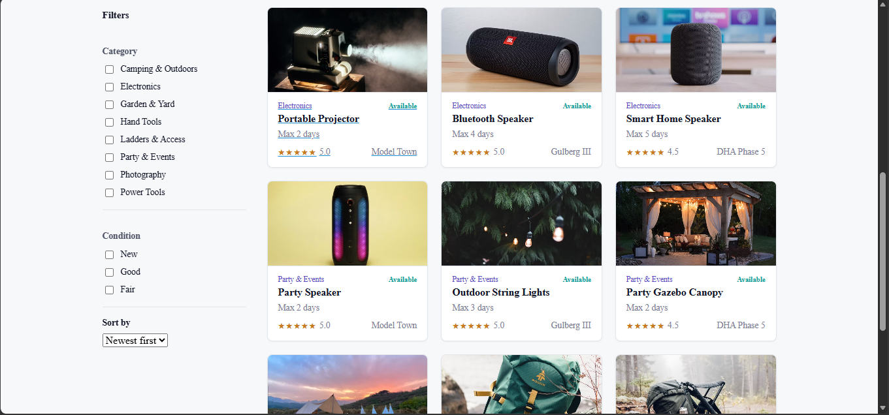
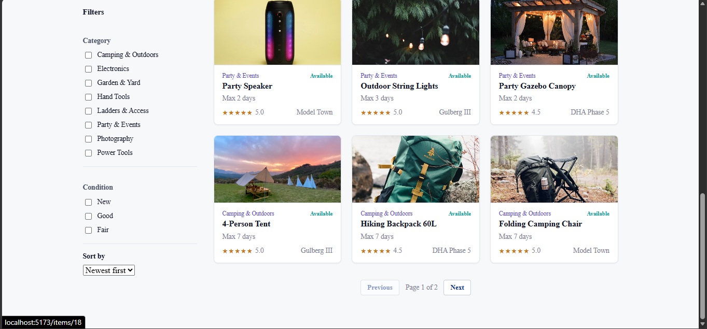
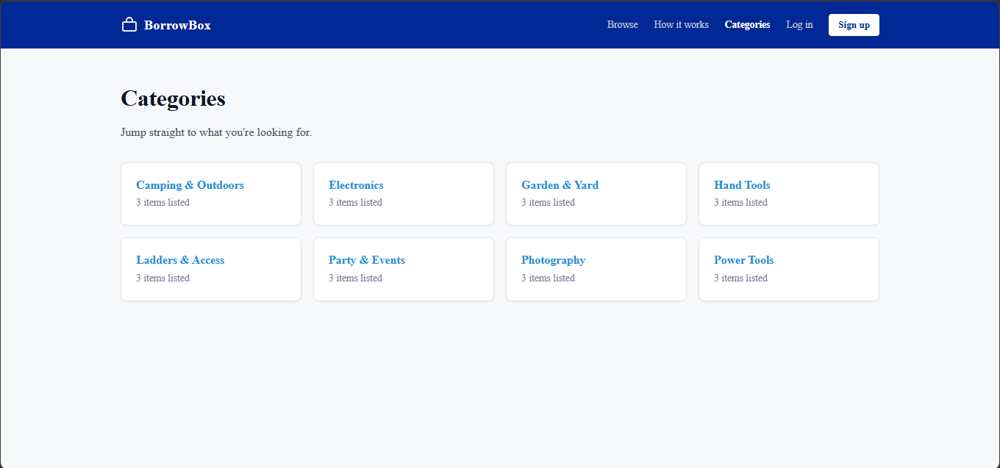
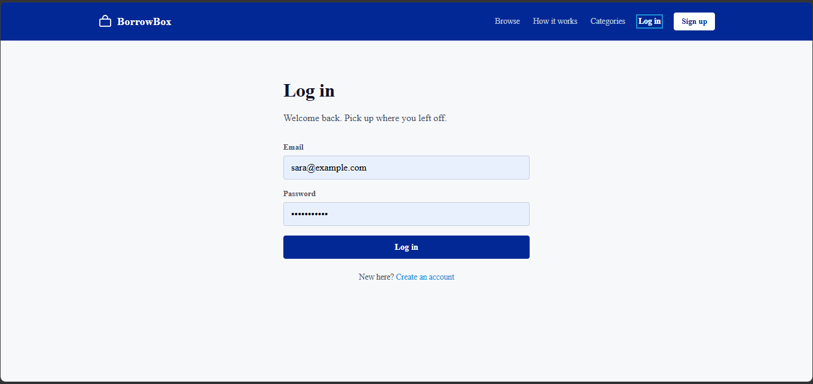
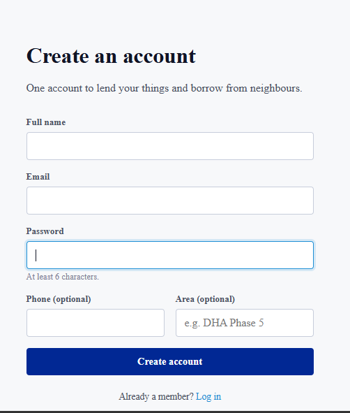
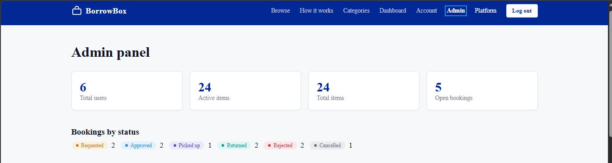
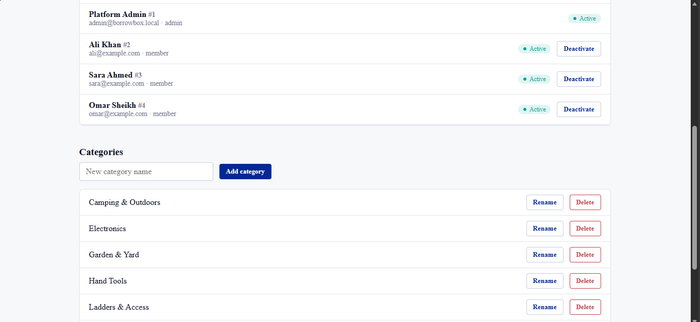
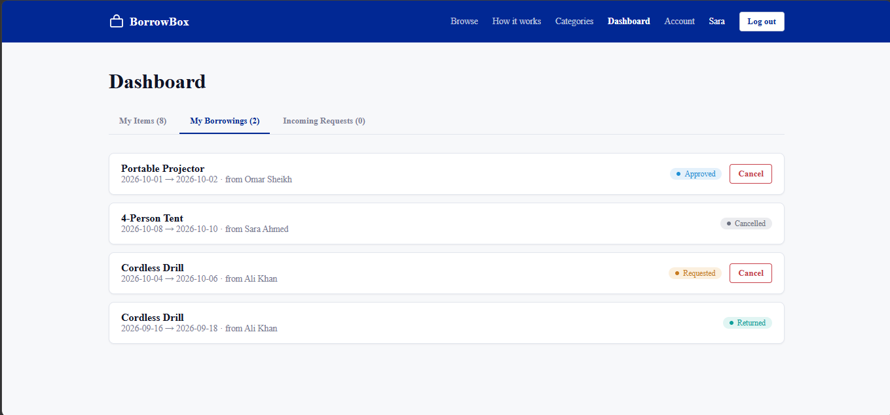
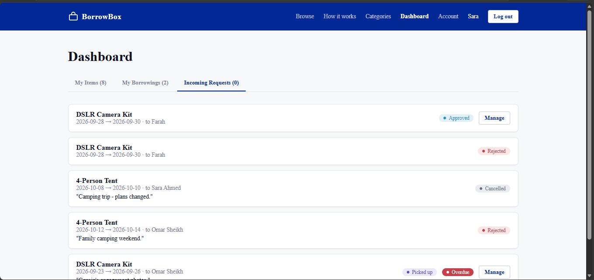

# BorrowBox

A peer-to-peer lending platform: neighbours lend tools and gadgets they are not using, and borrow what they need.

## How to run

Requires Node.js and PostgreSQL (running).

Backend (creates the database, tables and sample data automatically):

```bash
cd server
npm install
npm run dev
```

Frontend (in a second terminal):

```bash
cd client
npm install
npm run dev
```

Open http://localhost:5173

If your PostgreSQL password is not `postgres`, edit `DATABASE_URL` in `server/.env`.

## Demo logins

| Role | Email | Password |
|---|---|---|
| Admin | admin@borrowbox.local | admin1234 |
| Member | ali@example.com | password123 |
| Member | sara@example.com | password123 |
| Member | omar@example.com | password123 |

## Screenshots

### Home
Search by keyword and dates, then filter by category and condition.



### Browse items
Item cards show a photo, category, availability, maximum loan days, rating and pickup area.



Results are paginated (12 per page).



### Categories
Eight categories with three items each.



### Log in and sign up





### Admin panel
Platform totals and bookings by status.



Manage users (activate or deactivate) and categories (add, rename, delete).



### Member dashboard
Track items you borrow and cancel pending requests.



Manage requests for your own items: approve, hand over, and mark returned.


